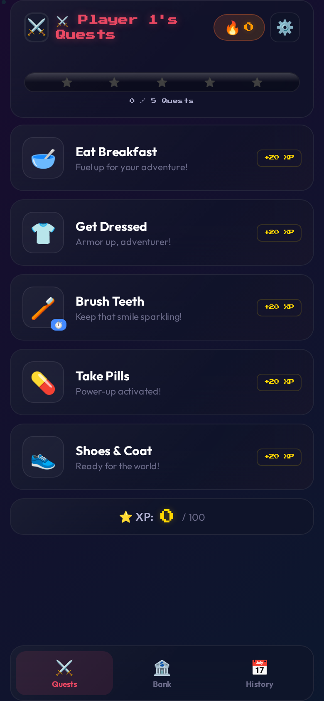
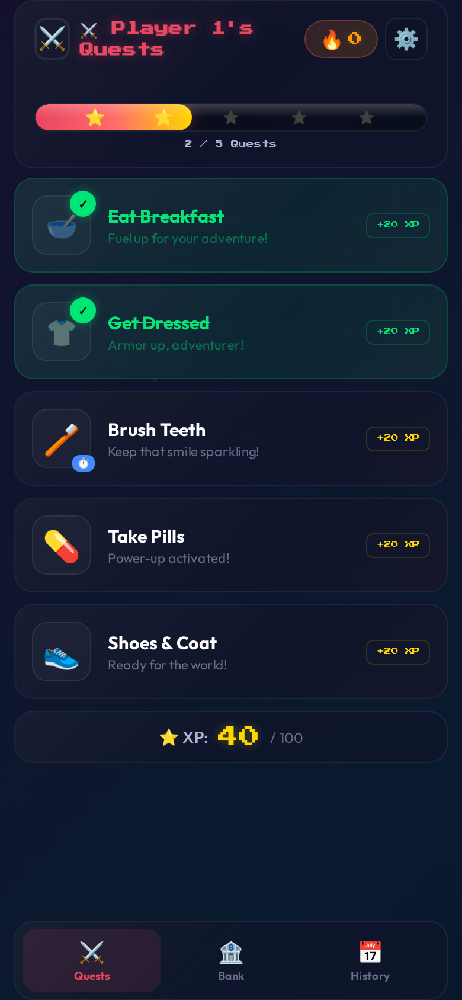
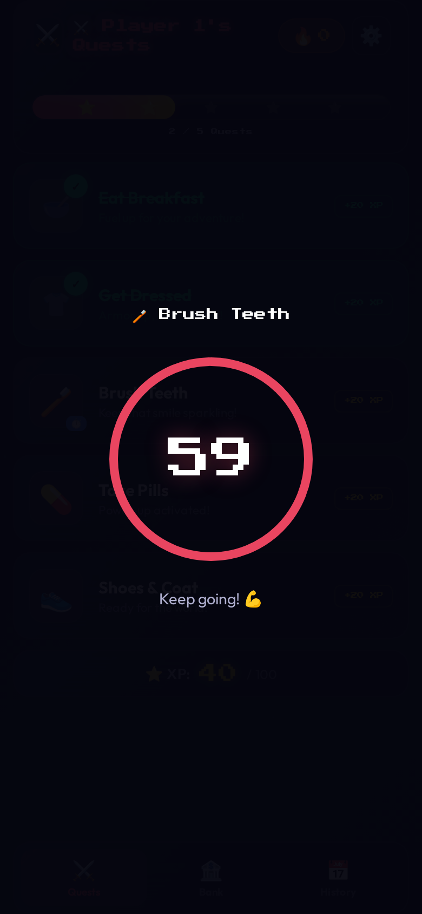
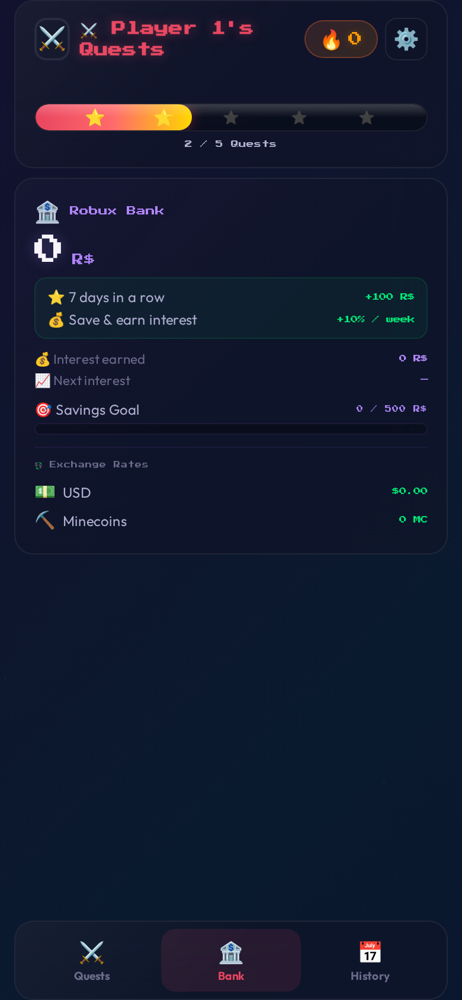
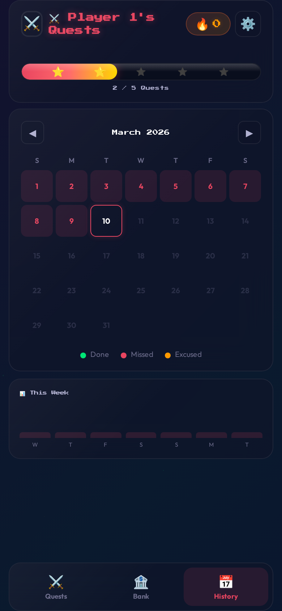
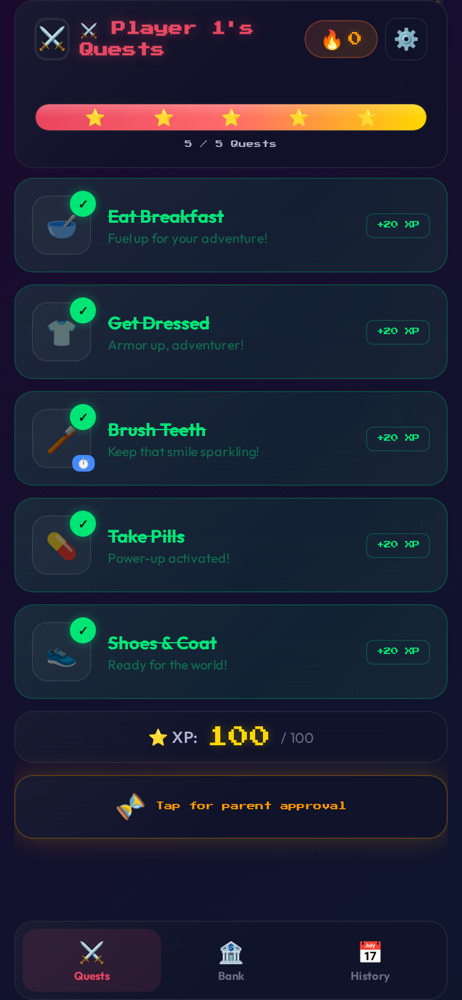

# ⚔️ Morning Quests

A gamified morning routine app for kids. Built as a zero-dependency PWA that runs on any device — designed for iPad home screens.

Replace your falling-apart paper chore chart with something your kid will actually *want* to use.

<p align="center">
  
  
  
</p>
<p align="center">
  
  
  
</p>

## Features

### 🎮 Quest System
- **Tap to complete** daily chores with particle burst animations and 8-bit sound effects
- **Configurable quests** — add, remove, reorder, change icons, set XP from the parent UI
- **Timer quests** — "Brush Teeth" has a 60-second SVG ring countdown; kids can't skip it
- **XP tracking** with animated progress bar

### 🏦 Robux Bank
- Earn **100 R$** for every 7-day streak (⭐ star milestone)
- **10% weekly compound interest** on saved balance
- **FX Exchange Rates** — see balance in USD and Minecoins (real-world rates)
- Savings goal progress bar
- Parent-controlled **cashout** in settings

### 📅 Calendar & History
- Monthly heatmap: 🟢 done, 🔴 missed, 🟠 excused
- **Streak recovery** — parent can excuse a missed day via PIN to save the streak
- Weekly summary bar chart

### 👥 Multi-Kid Profiles
- Each kid gets independent quests, bank, streaks, and history
- Profile picker on launch
- Parent manages profiles in settings

### 🔒 Parental Controls
- **4-digit PIN** gates approval, settings, and cashout (default: `1234`)
- Parent approves each day's completion before the streak counts
- Quest editor, profile manager, PIN change all behind the gate

### 🎨 Premium UI
- Animated gradient background
- Glassmorphism frosted-glass cards
- 8-bit synthesized sound effects (Web Audio API, no files)
- Confetti, particle bursts, floating XP
- Bottom nav tabs (Quests → Bank → History)
- PWA — installable on iPad/Android home screens

## Quick Start

### Option 1: Static (no persistence)
```bash
# No dependencies. Just serve the files:
python3 -m http.server 8080
```
Data lives in the browser's `localStorage` only.

### Option 2: FastAPI (recommended — server-side persistence)
```bash
pip install fastapi uvicorn
uvicorn server:app --host 0.0.0.0 --port 8080
```
State is saved to a `data/` directory on the server. History, streaks, and bank balances survive across devices and cache clears. The app auto-detects the API and syncs transparently.

Open `http://localhost:8080` on your browser or iPad.

### Install as App (iPad)

1. Open in Safari
2. Tap **Share** → **Add to Home Screen**
3. It runs fullscreen like a native app

## Customization

Everything is configurable from the **parent settings UI** (⚙️ → PIN):

| Setting | How |
|---------|-----|
| **Add/remove chores** | ⚙️ → Edit Quests |
| **Change icons** | Tap the emoji in the quest editor to cycle |
| **Set timer** | Enter seconds (0 = no timer) per quest |
| **Interest rate** | Edit `interestRate` in `app.js` config |
| **Robux per star** | Edit `robuxPerStar` in `app.js` config |
| **Days per star** | Edit `daysPerStar` in `app.js` config |
| **Savings goal** | Edit `savingsGoal` in `app.js` config |
| **Default PIN** | `1234` — change in-app via settings |

## Tech Stack

- **HTML/CSS/JS** — zero frontend dependencies, no build step
- **FastAPI** — optional Python backend for server-side state persistence
- **Web Audio API** — synthesized 8-bit sounds
- **localStorage + server sync** — works offline, syncs when connected
- **PWA** — `manifest.json` + meta tags for home screen install

## File Structure

```
├── index.html       # App shell & overlays
├── style.css        # Glassmorphism UI & animations
├── app.js           # Client logic + server sync
├── server.py        # FastAPI backend (optional)
├── manifest.json    # PWA manifest
├── data/            # Server-side state (gitignored)
└── screenshots/     # App screenshots
```

## License

MIT — do whatever you want with it. If your kid actually brushes their teeth because of this, that's payment enough.
